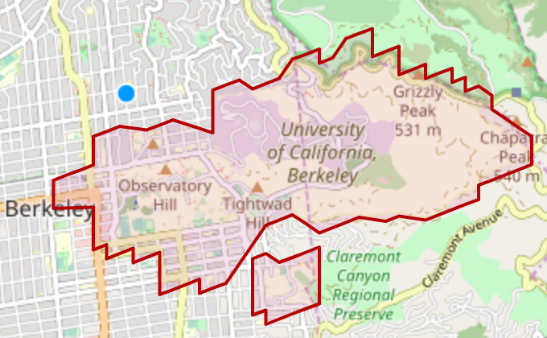

So I needed a geofence on all college campuses in the US for an anonymous video social network for college campuses, and the only dataset available was $5,000 and I don't have that kind of money lol. I just decided to create one myself.

I used OpenStreetMap API to gather the polygonal bounding shapes of all colleges and universities in the WORLD. I then did some scripting magic to clean and transform that data into polygons (granted, this took a while).

I then transformed the polygons into s2 cells with s2geometry by google.

At this point I thought I would need s2 cells because I thought I would be using a NoSQL (DynamoDB) database with the s2 cell (level 16) as the database index, and reverse timestamp as secondary index. 

I didn't discover this whole time that Elasticsearch provides much better geo-querying for both polygons and coordinates than what I had spent my time creating from scratch. However, now that I had polygons I might as well use them in Elasticsearch.

I then formatted my data in preperation for using Elasticsearch. I converted the s2 cells back into polygons to filter any malformed polygons from the OpenStreetMap API endeavour, and added additional info to the colleges/universities like headcount, timestamp, alias, etc. and those are the datasets available in "datasets". Enjoy!

P.S. 
Theres 2 different versions for the US because OpenStreetMap does not have the polygon of EVERY college/university. 

One has speculative boundaries for every college/university based on the attendance headcounts. The other has accurate boundaries, but only for those that existed in OpenStreetMap. The other colleges/universities that don't have polygons have coordinates instead.

Here's a little fun work with an algorithm to get back from s2 cells to polygons.

First we find all the "islands" of a given college or university. We generate an inner (not depicted) and outer border of s2 cells for each island, find the matching coordinate set, and then build our polygon.

A failed attempt using simple counterclockwise polygon building from the centroid (worse for irregular shapes).

Fixed it using some coordinate minimum cost path searching.

